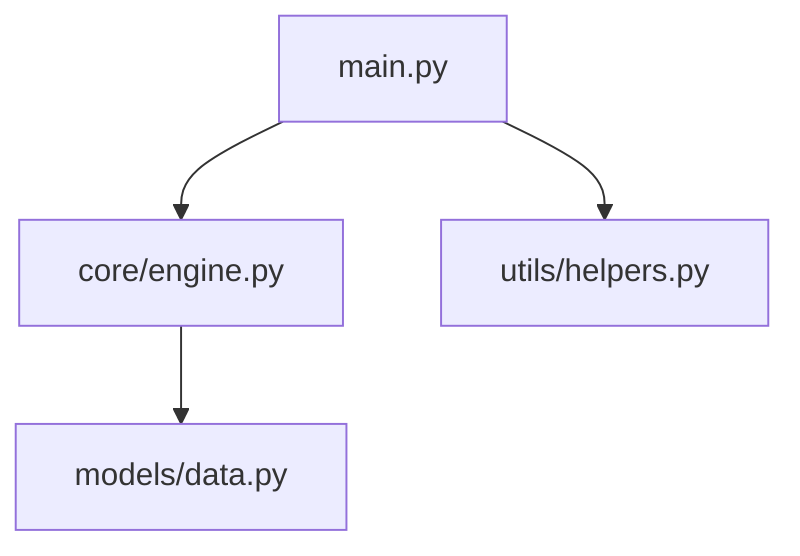

# Documentation Skill

Use this skill when generating documentation. Tracing ensures you document what actually exists and how it connects, not outdated assumptions.

## Documentation Types

### Architecture Documentation

Trace from entry points to understand system structure:

```bash
# Trace main entry points
llmfiles main.py --deps
llmfiles api/app.py --deps
llmfiles cli/main.py --deps

# Each trace shows a different "view" of the architecture
```

From traces, document:
- Layer boundaries (what imports what)
- Core modules (imported by many)
- External dependencies
- Entry points and their purposes

### API Documentation

Extract function/class signatures:

```bash
llmfiles api/routes.py --deps --chunk-strategy structure
```

This gives you:
- Endpoint definitions
- Request handlers with signatures
- Dependency chain for each endpoint

### Module Documentation

For a specific module:

```bash
# What this module provides
llmfiles module.py --chunk-strategy structure

# What depends on this module (reverse lookup)
llmfiles . --grep-content "from module import\|import module"
```

### Feature Documentation

Trace a feature end-to-end:

```bash
# Find feature entry point
llmfiles . --grep-content "def feature_name"

# Trace full feature path
llmfiles feature/main.py --deps --chunk-strategy structure
```

Document:
- Entry point
- Processing steps
- External dependencies
- Configuration points

## Documentation Workflow

### Step 1: Inventory Entry Points

```bash
llmfiles . --grep-content "if __name__\|@app.route\|click.command" --include "**/*.py"
```

### Step 2: Trace Each Entry Point

```bash
for entry in main.py cli.py api/app.py; do
  echo "=== $entry ==="
  llmfiles $entry --deps
done
```

### Step 3: Extract Structure

```bash
llmfiles . --deps --chunk-strategy structure --include "**/*.py"
```

### Step 4: Identify Undocumented Code

Compare trace output with existing docs:
- Files in trace but not in docs = missing documentation
- Files in docs but not in trace = possibly dead code

## Common Documentation Patterns

### "Document this endpoint"

```bash
# Trace the endpoint
llmfiles api/endpoints/users.py --deps --chunk-strategy structure
```

Document:
1. Route and method
2. Request parameters (from function signature)
3. Dependencies (from trace)
4. Response format

### "Document the data flow"

```bash
# Trace from input to output
llmfiles data_pipeline/main.py --deps

# Output shows the transformation chain
```

### "Generate changelog from code"

```bash
# Find what changed
llmfiles . --grep-content "TODO\|FIXME\|XXX"

# Trace changed files to understand impact
llmfiles changed_file.py --deps
```

## Output Formats

### Dependency Graph (Mermaid)

From trace output, generate:



### Module Index

From `--chunk-strategy structure` output:

```markdown
## Modules

### core/engine.py
- `class Engine` - Main processing engine
  - `process(data)` - Process input data
  - `validate(data)` - Validate before processing

### utils/helpers.py
- `format_output(result)` - Format for display
```

## Keep Docs in Sync

Use tracing to verify documentation stays current:

```bash
# Periodic check: trace and compare with docs
llmfiles main.py --deps > current_structure.txt
diff current_structure.txt docs/architecture.md
```

## Prerequisites

Requires `llmfiles` CLI:
```bash
uv add git+https://github.com/fblissjr/llmfiles
```
